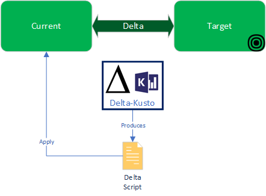

# Delta-Kusto

Delta-Kusto is a Command-line interface (CLI) enabling Continuous Integration / Continuous Deployment (CI / CD) automation with Kusto objects (e.g. tables, functions, policies, security roles, etc.) in [Azure Data Explorer](https://docs.microsoft.com/en-us/azure/data-explorer/data-explorer-overview) (ADX) databases.  It can work on a single database, multiple databases, or an entire cluster.  It also supports *multi-tenant* scenarios.

Delta-Kusto is doing what [SQL Database projects](https://docs.microsoft.com/en-us/sql/ssdt/project-oriented-offline-database-development) do for Microsoft SQL:  enabling CI/CD, change management and source control of Kusto databases.  It works with and produces Kusto scripts so it doesn't require a new language / serialization format and can therefore be used with other tools of the ADX ecosystem.

Delta-Kusto runs on both Linux & Windows as a stand-alone executable.  It is meant to be used in *headless* mode.

## Overview

The high-level view of delta-kusto is the following:

The green boxes represent [sources](documentation/sources.md).  A source can be:

* ADX Database
* Kusto scripts (either a Kusto script file or a hierarchy of folders containing Kusto scripts)

Delta-Script computes the *delta* between the two sources.  The *delta* can be represented as a Kusto script containing the kusto commands required to run on the *current source* so it would be identical to *target source*.

This *delta script* can either be applied directly to an ADX Database or saved as a Kusto script for human validation.  Human validation often are required, especially if `.drop` commands are issued (which could result in data lost).

Using different combinations of sources can enable different scenarios.

### 1. ADX Database (current) to Kusto scripts (target)

This scenario is the most straightforward CI / CD scenario:  take an ADX database and bring its content to the state of a target set of scripts.

Delta Kusto can generate a delta script with the minimal command set to bring the database to the *state* of the target script.  For instance, if a table is missing in the database, the delta script will contain the corresponding `.create table` command.

### 2. Kusto scripts (current) to ADX Database (target)

Here we reverse the roles from the previous scenario.

Here are two use case for that scenario:

1.  We start with an empty *current* script:  the delta script becomes a complete script to recreate the target database (delta scripts can be exported in a folder hierarchy for human readability and easy git-diff)
1.  The *current* script could represent the last state of a production database and the *target* database could be the dev database.  In this case, the delta script will show the changes done in the dev environment.

Basically, this scenario is useful to reverse engineer changes done *manually* to an environment.

### 3. Kusto scripts (current) to Kusto scripts (target)

This is the *offline sync* scenario:  we take 2 set of scripts and generate the delta between them.

For instance, the *current* scripts could represent the state of a database while the target scripts could represent the desired state for that database.  The delta script is computed *offline* in the sense that no *real* ADX database is consulted.

This scenario can be useful in highly controlled environment where the delta can be generated without access to the database.

### 3. ADX Database (current) to ADX Database (target)

This is the *Live Sync* scenario:  we want to bring an ADX database to the same state than another one.

## Limitations

Delta-Kusto is currently in development.  It has no releases yet.