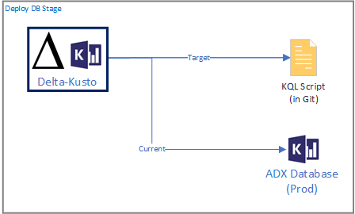

# Using Delta Kusto in Azure DevOps

This article shows how to use [Delta Kusto](https://github.com/microsoft/delta-kusto) in an [Azure DevOps YAML Pipeline](https://docs.microsoft.com/en-us/azure/devops/pipelines/yaml-schema).

## Scenarios

We are going to look at two different scenarios quite typical in CI / CD processes.

### Reverse Engineer

In this scenario we want to reverse engineer a *development* database.  We want to find the gap between a git-stored KQL script which represent what we think the database is and the actual database.

The delta (script) between those two is going to be persisted as a pipeline artefact.

Typically that pipeline is used to detect changes (or configuration drift).  For this reason, it **isn't** triggered automatically (e.g. on commits).  The delta can be used to adjust the git-stored KQL script.

### Deploy DB

In this scenario we want to deploy the git-stored KQL script to our staging database and then to production.

We can use the built-in [Azure Dev-Ops approvals](https://docs.microsoft.com/en-us/azure/devops/pipelines/process/approvals?view=azure-devops&tabs=check-pass).

Each stage deploys the KQL Script to an ADX Database via the delta between the two.

(Production database is shown in the diagram but the same stage is used for staging and production database)

## Final result

## Pipelines explained

## Install...

## Summary