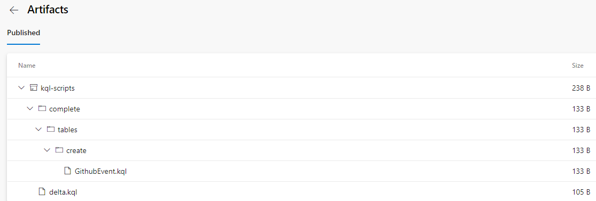

# Using Delta Kusto in Azure DevOps

This article shows how to use [Delta Kusto](https://github.com/microsoft/delta-kusto) in an [Azure DevOps YAML Pipeline](https://docs.microsoft.com/en-us/azure/devops/pipelines/yaml-schema).

In order to use this tutorial in an Azure DevOps project, we need to copy this GitHub folder to a Git repo, create the 2 pipelines by pointing to the YAML files (details below) and add required pipeline variables.

## Scenarios

We are going to look at two different scenarios quite typical in CI / CD processes.

### Reverse Engineer

In this scenario we want to reverse engineer a *development* database.  We want to find the gap between a git-stored KQL script which represent what we think the database is and the actual database.


The delta (script) between those two is going to be persisted as a pipeline artefact.

This pipeline uses two Delta Kusto jobs.  One does what was just described.  The other completely reverse engineer the database and export the complete database script into a script folder within the same artefact.

Typically that pipeline is used to detect changes (or configuration drift).  For this reason, it **isn't** triggered automatically (e.g. on commits).  The delta can be used to adjust the git-stored KQL script.

The [pipeline is available here](reverse-engineer).

### Deploy DB

In this scenario we want to deploy the git-stored KQL script to our staging database and then to production.


We can use the built-in [Azure Dev-Ops approvals](https://docs.microsoft.com/en-us/azure/devops/pipelines/process/approvals?view=azure-devops&tabs=check-pass).

Each stage deploys the KQL Script to an ADX Database via the delta between the two.


(Production database is shown in the diagram but the same stage is used for staging and production database)

The [pipeline is available here](deploy-db).

## Final results

Let's see how the solution looks like when executed.  We will look how the pipelines are implemented after.

### Reverse Engineer

We see the job runs very quickly in one stage.


If we look at the artefacts


We can see one artefact.  

If we look at it we see a `complete` folder containing the scripts to create the entire database while the file `delta.kql` contains the delta between our original script and the database.



We could use the delta script to adjust our database script before deploying it to staging and production.

### Deploy DB

When the deploy-db pipeline is run, we notice it has 3 stages:


The first stage, `packaging` simply packages the scripts.  This is equivalent to a *build* stage where we take a snapshot of the scripts before pushing it to different environment.

The second stage, `Push to staging`, is run immediately while the third one, `Push to production`, is waiting for approval.

If we looked at the staging database, we would see it is now matching the script we have in Git.

## Pipelines explained

Let's now look at the pipelines themselves.

### Reverse Engineer

Let's look at the YAML pipeline in [reverse-engineer/rev-pipeline.yaml](reverse-engineer/rev-pipeline.yaml).

It has one job with four steps.

#### Install Delta-Kusto|

Installs Delta Kusto CLI on the Azure DevOps.

```yaml
- bash:  |
    clientVersion=$(curl https://delta-kusto.azurefd.net/clientVersion/unique?fromClientVersion=0)
    # Display the version on console
    echo "Client Version:  $clientVersion"
    wget https://github.com/microsoft/delta-kusto/releases/download/$clientVersion/delta-kusto-linux.tar.gz
    tar --extract --file delta-kusto-linux.tar.gz
    chmod +x ./delta-kusto
    displayName:  Install Delta-Kusto
```

It does that by using the client version API to retrieve the latest version of the CLI.  In this case we look for the last version of `0.*.*.*`.

Once we have that version, we download the CLI from GitHub (using `wget`).  Since we defined our agent to be Linux-based, we download the Linux CLI.  Using a Windows agent we would simply replace linux by windows.

We then unzip it (with `tar`) and `chmod` it (to make it executable).

#### Prep script folder

Simply create folders (with `mkdir`) to receive the delta script and the complete script.

#### Run Delta-Kusto

Here we actually run the Delta-Kusto CLI

```yaml
- bash:  |
    clusterUri=$(CLUSTER_URI)
    echo "Cluster URI:  $clusterUri"
    # Package the login in a JSON payload
    login='{"tenantId":"$(TENANT_ID)","clientId":"$(CLIENT_ID)","secret":"$(SECRET)"}'
    ./delta-kusto -p documentation/tutorials/az-dev-ops/reverse-engineer/rev-engineer-parameters.yaml -o jobs.download-dev.target.adx.clusterUri=$clusterUri jobs.delta-dev.target.adx.clusterUri=$clusterUri tokenProvider.login=$login
    displayName:  Run Delta-Kusto
```

Here we prepare a few local variables by grabbing pipeline variables.  Since those variables are *secrets* we didn't defined them in the YAML but rather in the UI.  An even more secure setup would be to gather the secrets from an Azure Keyvault.

We package the login as one JSON node to override it together.

We call the CLI with the parameter file found in [reverse-engineer/rev-engineer-parameters.yaml](reverse-engineer/rev-engineer-parameters.yaml).  We override the cluster URI for the two jobs inside the parameter file as well as the login.

The parameter file point the `delta-dev` job to the Git [state](state) folder as *current*.

#### Publish Artifact: kql-scripts

Finally we publish the scripts as a pipeline artefact:

```yaml
- publish: documentation/tutorials/az-dev-ops/reverse-engineer/kql-scripts
    artifact:  kql-scripts
    displayName: 'Publish Artifact: kql-scripts'
```

This allows the scripts to be consulted by the pipeline user.

### Deploy DB

Let's look at the YAML pipeline in [deploy-db/deploy-db-pipeline.yaml](deploy-db/deploy-db-pipeline.yaml).

It has 3 stages with one job each:

Stage|Description
-|-
Packaging|Packages the scripts to be used by the other two stages
Staging|Deploy the KQL scripts to the staging database
Production|Deploy the KQL scripts to the production database

The last two scripts uses the YAML pipeline template [deploy-db/deploy-db-template.yaml](deploy-db/deploy-db-template.yaml).  That pipeline has three steps:

1.    Download Delta Kusto CLI
1. Download pipeline artefact
1. Run Delta Kusto CLI

The last step uses [deploy-db/push-state-to-db-parameters.yaml](deploy-db/push-state-to-db-parameters.yaml) as parameter file which dictates the behaviour of Delta Kusto CLI.

In this case, Delta Kusto pushes the content of [../state](../state) to the ADX database (via its delta).

## Summary

We've covered 2 different Azure DevOps pipeline examples to show the possibility of using Delta Kusto with Azure DevOps.

Those pipelines can be altered to fit any project's needs.

The key steps are:

1.    Download the Delta Kusto CLI
1. Invoke the CLI with a parameter file
