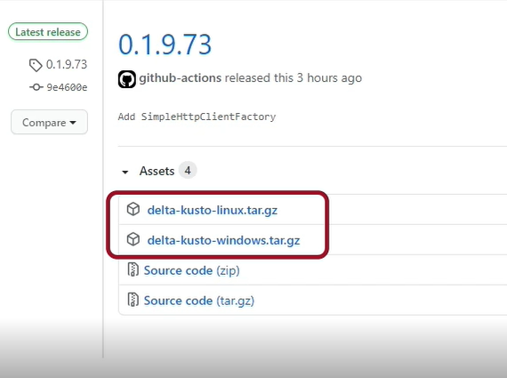
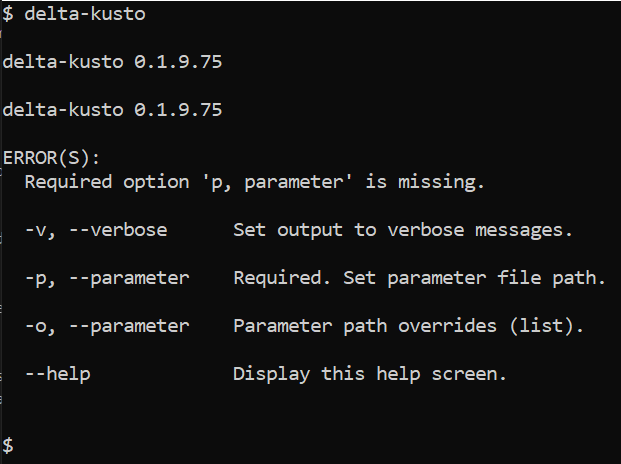

#   Installing Delta Kusto CLI

This article explains how to install [Delta Kusto](https://github.com/microsoft/delta-kusto) Command Line Interface (CLI) on both Windows and Linux.

This is typically done within a CI/CD environment, i.e. on an ephemeral compute.  But it can also be done on a laptop.

## Releases

Delta Kusto releases are available on the [Delta Kusto GitHub repo](https://github.com/microsoft/delta-kusto).

The [release tab](https://github.com/microsoft/delta-kusto/releases) lists all the available releases, starting with the latest one.

Delta Kusto is available on Windows and Linux as a single-file executable.



From there we can copy the URL for the Windows or Linux tar.gz file, depending on which system we which to install it on.

## Windows

For Windows, we are going to use a PowerShell environment.

We first download the release in a temporary directory:

```
wget <RELEASE URL> -OutFile delta-kusto-windows.tar.gz
```

We of course need to replace the URL with the one in the release we chose.

Once it has downloaded we can extract the executable:

```
tar --extract --file delta-kusto-windows.tar.gz
```

This will uncompress the `delta-kusto.exe` file.  This is the Delta Kusto CLI we can start using.

We can delete the `tar.gz` file.

## Linux

The procedure is similar on Linux.  We start by the release download:

```
wget <RELEASE URL>
```

We of course need to replace the URL with the one in the release we chose.

Once it has downloaded we can extract the executable:

```
tar --extract --file delta-kusto-linux.tar.gz
```

This will uncompress the `delta-kusto` file.  This is the Delta Kusto CLI we can start using.

An optional step is to copy the executable file to the bin folder:

```
cp delta-kusto /bin
```

This makes it more easily available for running.

## Test

In both Windows and Linux case we should be able to run the CLI and obtain something similar to this output:

